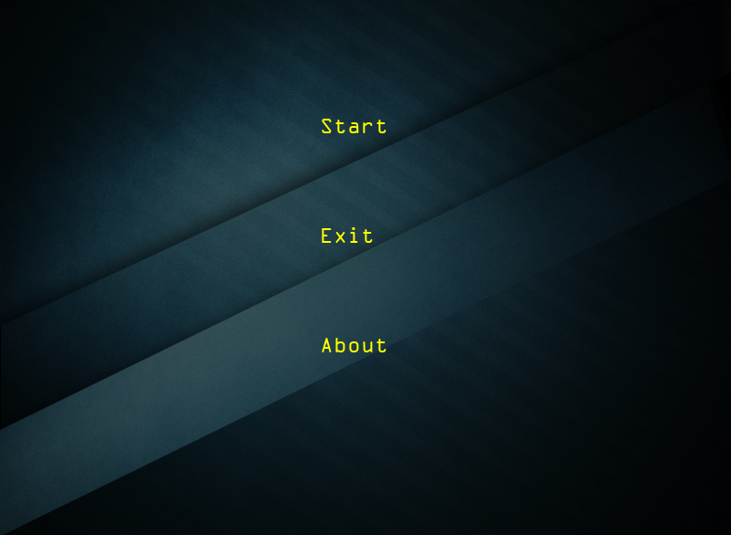

# Breakout 

A clean OpenGL project.

# Review


# Run
```shell
mkdir my_build & cd my_build
cmake .. && make 
./breakout
```

# Features
* welcome
* OpenGL only
* Sprites rendering
* Game Levels
* Collision detection
* Particles
* Postprocessing
* Powerup
* Audio
* Render text
* Others
